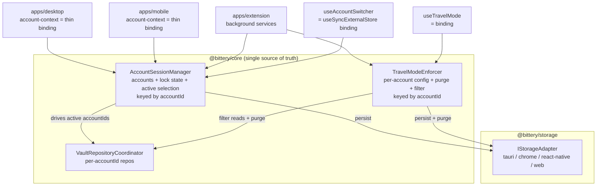

## Account & Travel Mode Rebuild

Client-side, offline-first (per your call on the trust model). Server stays unchanged except minor cleanups. The goal is **one owner per concept**, consumed identically by desktop, extension, and mobile.

### Target architecture

### Key principles

- **Stable `accountId` as the primary key**, not email. Email becomes display-only metadata that can change without breaking storage, caches, or active-account state.
- **One mutation path** per operation (switch/lock/remove/unlock/login) lives in `AccountSessionManager`. No more two `switchAccount` implementations with different semantics.
- **One enforcement point** for travel mode: purge + read-filter both owned by `TravelModeEnforcer`, applied through the coordinator. Extension stops reading raw cache.
- **Explicit account state machine** instead of inferred heuristics (`resolvePreferredEmail`, `localKeys.length < serverVaults.length`).
- Platform specifics (Tauri broadcast, biometrics, IPC) injected as callbacks, not branched inside core.

---

### Phase 0 - Stable accountId (foundational, lands first)

Today everything is keyed on email: `getAccountKey(email, suffix)` and the in-memory `accountCaches` map in [tauri.ts](packages/storage/src/adapters/tauri.ts), the per-email repos in [vault-repository-coordinator.ts](packages/core/src/services/vault-repository-coordinator.ts), travel-mode config in [travel-mode-service.ts](packages/core/src/services/travel-mode-service.ts), and `ActiveAccount` (`{ type: "single"; email }`) in [storage/types.ts](packages/storage/src/types.ts). This is fragile: emails can change and the repeated `email.toLowerCase()` normalization is a recurring bug source.

- Add `accountId: string` (locally-generated UUID, created once at first login) to `AccountMetadata` in [storage/types.ts](packages/storage/src/types.ts). Email/userId/serverUrl stay as fields but become non-key metadata.
- Change `ActiveAccount` to `{ type: "single"; accountId } | { type: "all" } | null`.
- Re-key all storage namespacing: `getAccountKey` and `accountCaches` use `accountId`; keychain JWT key, session data, vault keys, cached items/vaults, biometric flags all move to the `accountId` namespace.
- At login, dedupe via a `(serverUrl, userId) -> accountId` lookup over the accounts list: if a matching account exists, reuse its `accountId`; otherwise mint a new UUID. This is the only place email/userId map to an `accountId`.
- Provide a one-time migration in the adapters: on first load, if legacy email-keyed entries exist, generate `accountId`s and rewrite keys. (No server DB migration - purely local storage. Worst case per project rules: local DB reset.)
- Coordinator (`repos`, `activeEmails`, `accountInfoByEmail`) re-keyed to `accountId`; `AccountInfo` in [account-resolver.ts](packages/core/src/services/account-resolver.ts) gains `accountId`. This lets us delete the `normalizeEmail`/`resolvePreferredEmail` logic since IDs are already canonical.
- Travel-mode config keyed by `accountId`.

All later phases assume `accountId` is the key.

### Phase 1 - Unified account model + AccountSessionManager

New file `packages/core/src/services/account-session-manager.ts`:

- Holds `accounts: AccountMetadata[]`, `lockState: Map<accountId, "locked"|"unlocked">`, `active: ActiveAccount`.
- Reactive store (`subscribe`/`getSnapshot`) so React binds via `useSyncExternalStore` (same pattern already used in [use-vault-repository-sync.ts](packages/core/src/hooks/use-vault-repository-sync.ts)).
- Single implementations of `login`, `addAccount`, `switchAccount`, `lockAccount`, `lockAll`, `removeAccount`, `unlock(All)` that wrap the storage adapter and emit changes.
- Platform hooks injected via constructor options: `onActiveChanged` (Tauri broadcast to extension), `onLockBroadcast`, `queryInvalidator`.
- Becomes the single owner of active selection, removing reliance on the module-level `cachedActiveAccount` in [tauri.ts](packages/storage/src/adapters/tauri.ts) as a competing source of truth.

### Phase 2 - Make existing hooks/contexts thin bindings

- Rewrite [use-account-switcher.ts](packages/core/src/hooks/auth/use-account-switcher.ts) to read/write through the manager (keep the same return shape so callers don't change).
- Reduce [apps/desktop/src/contexts/account-context.tsx](apps/desktop/src/contexts/account-context.tsx) to a thin provider over the manager; keep only the Tauri-specific autolock + biometric-trigger listeners. Remove its bespoke `switchAccount` (the one that clears sessions + `queryClient.clear()`) so switch semantics are identical everywhere.
- Do the same for [apps/mobile/src/contexts/account-context.tsx](apps/mobile/src/contexts/account-context.tsx).

### Phase 3 - Consolidate login/session registration

- `storeLoginSession` in [auth-service.ts](packages/core/src/services/auth-service.ts) (around line 552) stays the **only** place that registers an account.
- Remove the redundant `addAccountToList(...)` calls in [apps/desktop/src/routes/login.tsx](apps/desktop/src/routes/login.tsx) and [apps/desktop/src/components/add-account-dialog.tsx](apps/desktop/src/components/add-account-dialog.tsx) (route them through `AccountSessionManager.login` instead).

### Phase 4 - Centralize travel mode enforcement

New file `packages/core/src/services/travel-mode-enforcer.ts` replacing the scattered logic in [travel-mode-service.ts](packages/core/src/services/travel-mode-service.ts) and [travel-mode-sync.ts](packages/core/src/services/travel-mode-sync.ts):

- Per-account config keyed by `accountId` (drop the `getTravelModeService(storage)` global singleton that ignores its storage arg).
- **One** `applyConfig(accountId, config)` that purges storage **and** in-memory repo data via the coordinator in a single call - collapses the current three purge sites (`TravelModeService.purgeHiddenVaultData`, `VaultRepository.purgeHiddenVaults`, `coordinator.purgeHiddenVaultsForEmail`).
- Read-filtering becomes a safety net layered in `VaultRepositoryCoordinator.getAll/getByVault/getById` so hidden vaults never surface even if purge missed something.
- Replace the restore heuristic in `useTravelMode` with explicit transition detection (previous `enabled` true -> now false triggers a server refetch for that account, queued if offline).
- Point the extension ([apps/extension/src/background/vault-utils.ts](apps/extension/src/background/vault-utils.ts)) at the enforcer instead of `storage.getTravelModeCache` directly, killing the cache-divergence class of bugs.
- Delete dead `shouldCacheVaultForTravelMode`.

### Phase 5 - Sync routing + 401 cleanup

- Attribute sync events to a concrete `accountId` (each connection knows its account) so the coordinator no longer needs `resolvePreferredEmail` guesswork in [vault-repository-coordinator.ts](packages/core/src/services/vault-repository-coordinator.ts).
- Fix 401 handling in [apps/desktop/src/lib/providers.tsx](apps/desktop/src/lib/providers.tsx) so only the failing account is invalidated instead of locking all accounts in "all" mode.
- Ensure active-account changes actually reach the extension (wire the existing-but-uncalled `broadcast_active_account_changed` Tauri command, consumed by [apps/extension/src/background/desktop-sync.ts](apps/extension/src/background/desktop-sync.ts)).

### Phase 6 - Tests + i18n + cleanup

- Unit tests for `AccountSessionManager` (switch/lock/remove/unlock state transitions) and `TravelModeEnforcer` (enable purges all layers, disable restores, sync event applies once).
- Move the hardcoded German/English strings in [apps/desktop/src/components/account-switcher.tsx](apps/desktop/src/components/account-switcher.tsx) into `packages/i18n/messages/*.json`, then run `pnpm i18n:generate`.
- Remove duplicate `MultiAccountItem` type definitions (consolidate in [item-service.ts](packages/core/src/services/item-service.ts)).

### Non-goals

- Server-enforced travel mode (rejected: breaks offline). Server keeps storing config + emitting `travel_mode_updated` only.
- No DB migrations or changes to the SSE/event-log sync transport.

### Risks

- Phase 0 re-keys all local storage; the one-time email->accountId migration must run before any read, or accounts appear logged out. Acceptable fallback per project rules is a local DB reset (re-login), so this is low-stakes but should still be verified on desktop/extension/mobile adapters.
- Touches the auth/unlock hot path; Phases 1-3 should land behind careful manual testing of login -> add second account -> switch -> lock -> unlock-all on desktop before wiring extension/mobile.
- Removing `AccountContext.switchAccount`'s `queryClient.clear()` means the manager must invalidate the right query keys explicitly.

